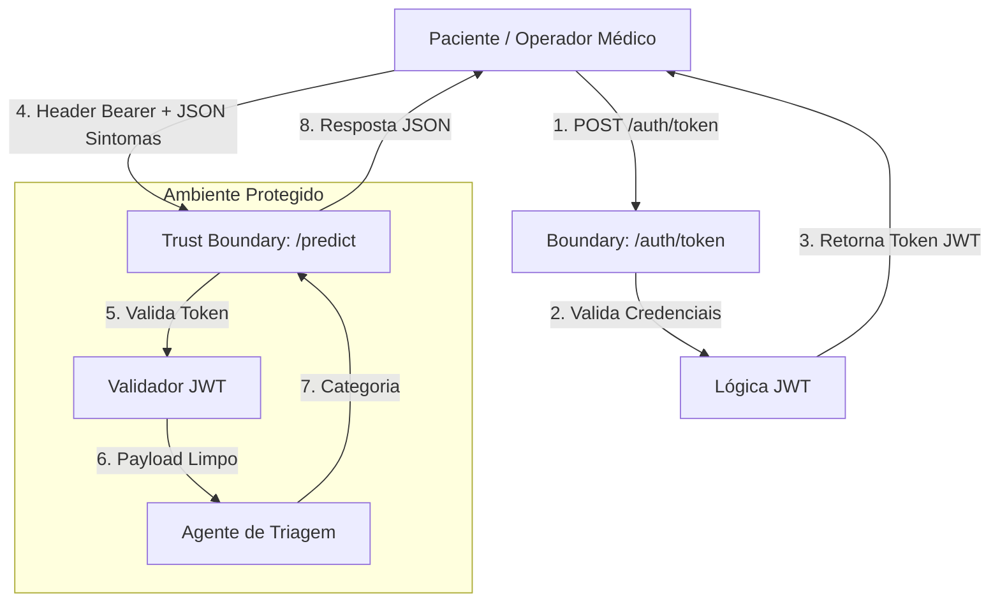

# HealthAssist API - Triagem Médica

API desenvolvida para o Projeto de Bloco de Análise e Segurança de Agentes de IA (Tema 3).

## Objetivo

Servir como backend seguro para triagem médica automatizada, priorizando o cumprimento da LGPD para dados sensíveis de saúde e prevenindo ataques de Negação de Serviço (DoS).

## Estrutura de Diretórios

```text
healthassist-api/
├── app/
│   ├── config.py
│   ├── database.py
│   ├── main.py
│   ├── seed.py
│   ├── middleware/
│   │   └── security_headers.py      # HSTS, X-Frame-Options, X-Content-Type-Options, CSP
│   ├── models/
│   │   ├── user.py                  # SQLModel
│   │   └── prediction_log.py        # SQLModel
│   ├── routers/
│   │   ├── auth.py                  # /auth/token (rate limited)
│   │   ├── health.py
│   │   └── predict.py               # POST / e GET /{id} (ownership check)
│   ├── schemas/
│   │   ├── auth.py
│   │   └── predict.py               # extra="forbid" no modelo de entrada
│   └── security/
│       ├── jwt.py
│       └── rate_limit.py
├── data/
│   └── .gitkeep
├── notebooks/
│   └── health-assist.ipynb
├── tests/
│   ├── conftest.py                  # fixtures: banco isolado em memória, 2 usuários
│   └── test_security.py             # 3 testes de segurança (OWASP)
├── .env-example
├── .gitignore
├── README.md
├── EDA.md
└── requirements.txt
```

## Como Executar Localmente

1. **Criar e ativar o ambiente virtual:**

```bash
python -m venv venv
source venv/bin/activate

```

2. **Instalar dependências:**

```bash
pip install -r requirements.txt

```

3. **Configurar variáveis de ambiente:**

Copie `.env-example` para `.env` e preencha os valores (principalmente `SECRET_KEY`, com uma chave forte e secreta — nunca reaproveite a do exemplo). `CORS_ORIGINS` aceita uma lista separada por vírgula das origens de front-end permitidas.

```bash
cp .env-example .env

```

4. **Popular o banco com um usuário inicial (opcional, para testar manualmente):**

```bash
python -m app.seed
# cria o usuário admin / senha123

```

5. **Iniciar o servidor:**

```bash
uvicorn app.main:app --reload

```

6. **Endpoints principais:**

- `GET /health`: estado da API (acesso público).
- `POST /auth/token`: autenticação e geração do token JWT. Limitado a **5 requisições/minuto por IP** contra brute force.
- `POST /predict/`: classificação de triagem (requer Bearer JWT). Rejeita qualquer campo fora do schema (`422 Unprocessable Entity`).
- `GET /predict/{id}`: retorna um log de predição pelo ID, **somente se pertencer ao usuário autenticado** (verificação de ownership / BOLA); caso contrário, `404`.

## Controles OWASP Top 10 Implementados

| Controle                        | Onde                                 | Observação                                                                                                                                                         |
| ------------------------------- | ------------------------------------ | ------------------------------------------------------------------------------------------------------------------------------------------------------------------ |
| Validação estrita de entrada    | `app/schemas/predict.py`             | `extra="forbid"` rejeita campos não previstos (422)                                                                                                                |
| Queries parametrizadas          | `app/models/*.py`, routers           | SQLModel/SQLAlchemy Core, sem SQL raw                                                                                                                              |
| Verificação de ownership (BOLA) | `GET /predict/{id}`                  | 404 tanto pra recurso inexistente quanto de outro usuário, evitando enumeração                                                                                     |
| Headers de segurança HTTP       | `app/middleware/security_headers.py` | HSTS, X-Frame-Options, X-Content-Type-Options, CSP, Referrer-Policy                                                                                                |
| CORS com allowlist              | `app/main.py` + `CORS_ORIGINS`       | Sem uso de `*` com `allow_credentials=True`                                                                                                                        |
| Rate limiting no login          | `app/routers/auth.py`                | 5 req/min por IP — alto o bastante pra não travar um usuário legítimo que erra a senha, baixo o bastante pra inviabilizar brute force de dicionário em tempo hábil |
| Senhas com hash                 | `app/security/jwt.py`                | bcrypt via passlib                                                                                                                                                 |
| JWT com expiração curta         | `app/security/jwt.py` + `.env`       | `ACCESS_TOKEN_EXPIRE_MINUTES` reduz a janela de exposição de um token vazado                                                                                       |

## Documentação do Dataset (Tema 3)

- **Nome do Dataset:** AKCIT/MedPT
- **Fonte / Link:** https://huggingface.co/datasets/AKCIT/MedPT
- **Autores**: Farber, Fernanda Bufon and Brito, Iago Alves and Dollis, Julia Soares and Ribeiro, Pedro Schindler Freire Brasil and Sousa, Rafael Teixeira and Filho, Arlindo R. Galvão;
- **Licença:** CC BY 4.0
- **Justificativa da Escolha:** Decidi usar esse dataset por dois motivos, o primeiro é que tem uma grande quantidade de dados de treino com mais de 100 mil perguntas entre pacientes e médicos, outro ponto é a relevância dos dados, para um modelo voltado a triagem de pacientes o dataset precisa conter interações relatando sintomas e possíveis respostas dos médicos, sendo assim, procurei um dataset que tivesse uma quantidade abrangente de sintomas e que os mencionasse nas mais diversas situações e esse dataset engloba perguntas realizadas na Doctoralia uma das maiores plataformas de telemedicina do Brasil.
- **Limpeza**:
  Devido a base de dados ter sido bem estruturada desde o princípio, na própria EDA é visível que não tem dados nulos ou duplicados e portanto não ví a necessidade de realizar limpeza dentro da base.

## Arquitetura de Segurança e DFD



**Análise CIA Sistemática (Componentes do DFD):**

**1. Client (Usuário Final / Aplicação Cliente):**
- **Integridade:** Validação de payload no lado do cliente antes do envio para evitar injeção de dados malformados.
- **Confidencialidade:** Comunicação deve ocorrer exclusivamente via HTTPS/TLS para proteger os dados de saúde em trânsito contra interceptação.
- **Disponibilidade:** Tratamento de timeouts e retentativas no cliente caso a API esteja sob alta carga.

**2. API Gateway / Main Router (FastAPI):**
- **Integridade:** Validação estrita de tipos via Pydantic em todas as requisições, rejeitando payloads anômalos.
- **Confidencialidade:** Isolamento de variáveis de ambiente (secret keys, URLs de banco).
- **Disponibilidade:** Implementação de Rate Limiting para mitigar ataques DoS, garantindo que o serviço de triagem permaneça operante.

**3. Módulo de Autenticação (`/auth`):**
- **Confidencialidade:** Senhas salvas com hash (bcrypt). Emissão de JWTs com tempo de expiração curto para reduzir a janela de exposição de tokens vazados.
- **Integridade:** Verificação da assinatura digital do JWT (Evita falsificação de identidade).
- **Disponibilidade:** Otimização da verificação de hash para evitar exaustão de CPU (prevenção contra ataques de negação de serviço algorítmica).

**4. Módulo de Predição (`/predict`):**
- **Confidencialidade:** Conformidade com a LGPD; os logs de inferência não armazenam PII (Informações Pessoalmente Identificáveis), apenas dados clínicos anonimizados.
- **Integridade:** O modelo de predição é imutável em tempo de execução; validação de que os inputs textuais estão dentro dos limites de tamanho aceitáveis (evita buffer overflow no modelo).
- **Disponibilidade:** Execução assíncrona ou paralelismo adequado para não bloquear o event loop do FastAPI durante a inferência.

**5. Camada de Banco de Dados:**
- **Confidencialidade:** Acesso restrito ao banco apenas pela API (sem exposição pública da porta do DB).
- **Integridade:** Uso de chaves primárias e transações ACID para evitar registros órfãos ou dados inconsistentes.
- **Disponibilidade:** Configuração de persistência em disco seguro (evitando perda de dados em caso de reinicialização do container/servidor).


