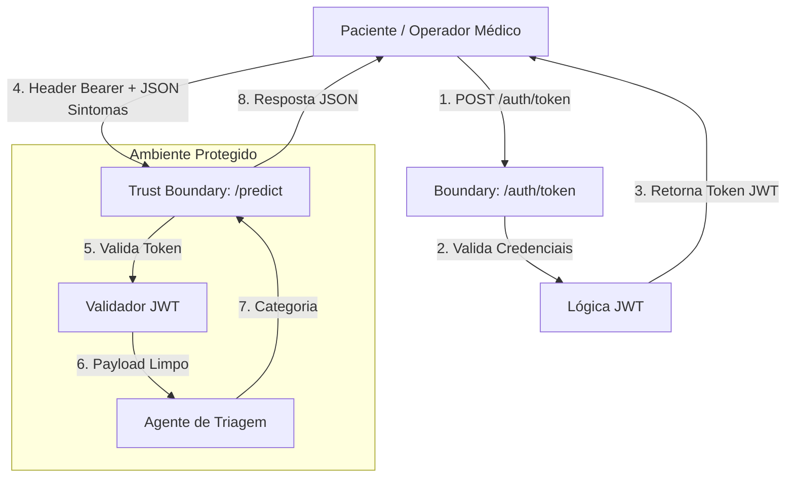

# HealthAssist API - Triagem Médica

API desenvolvida para o Projeto de Bloco de Análise e Segurança de Agentes de IA (Tema 3).

## Objetivo

Servir como backend seguro para triagem médica automatizada, priorizando o cumprimento da LGPD para dados sensíveis de saúde e prevenindo ataques de Negação de Serviço (DoS).

## Estrutura de Diretórios

```text
healthassist-api/
│
├── app/
│   ├── config.py
│   ├── database.py
│   ├── main.py
│   ├── seed.py
│   │
│   ├── middleware/
│   │   └── security_headers.py      # HSTS, X-Frame-Options,
│   │                                # X-Content-Type-Options, CSP
│   │
│   ├── models/
│   │   ├── user.py                  # SQLModel
│   │   └── prediction_log.py        # SQLModel
│   │
│   ├── routers/
│   │   ├── auth.py                  # /auth/token (rate limited)
│   │   ├── health.py
│   │   └── predict.py               # POST / e GET /{id}
│   │
│   ├── schemas/
│   │   ├── auth.py
│   │   └── predict.py               # extra="forbid"
│   │
│   └── security/
│       ├── jwt.py
│       └── rate_limit.py
│
├── notebooks/
│   └── health-assist.ipynb
│
├── tests/
│   ├── conftest.py
│   └── test_security.py
│
├── reports/
│   ├── zap_report.html
│   ├── zap_report.json
│   └── zap_findings.md
│
├── docs/
│   └── eda_report.md
│
├── scripts/
│   └── run_zap_scan.py             # Orquestra o scan ZAP via API REST

│
├── .env-example
├── .gitignore
├── README.md
├── EDA.md
└── requirements.txt
```

## Como Executar Localmente

### 1. Criar e ativar o ambiente virtual

```bash
python -m venv venv
source venv/bin/activate
```

### 2. Instalar dependências

```bash
pip install -r requirements.txt
```

### 3. Configurar variáveis de ambiente

Copie `.env-example` para `.env` e preencha os valores necessários.

```bash
cp .env-example .env
```

A variável `SECRET_KEY` deve utilizar uma chave forte e secreta.

`CORS_ORIGINS` aceita uma lista separada por vírgula das origens de front-end permitidas.

### 4. Popular o banco

Opcionalmente, para testes manuais:

```bash
python -m app.seed
```

O seed cria o usuário inicial definido pelo projeto.

### 5. Iniciar a API

Para desenvolvimento local:

```bash
uvicorn app.main:app --reload
```

Para permitir que o OWASP ZAP executado em Docker consiga acessar a API pelo host, utilize:

```bash
uvicorn app.main:app --host 0.0.0.0 --port 8000
```

A API ficará disponível em:

```text
http://127.0.0.1:8000
```

e, a partir do container Docker do ZAP:

```text
http://host.docker.internal:8000
```

> **Importante:** `127.0.0.1` dentro do container do ZAP aponta para o próprio container, e não para o computador que está executando o Docker.

## Endpoints principais

* `GET /health`: estado da API (acesso público).
* `POST /auth/token`: autenticação e geração do token JWT. Limitado a **5 requisições/minuto por IP** contra brute force.
* `POST /predict/`: classificação de triagem (requer Bearer JWT). Rejeita qualquer campo fora do schema (`422 Unprocessable Entity`).
* `GET /predict/{id}`: retorna um log de predição pelo ID somente se pertencer ao usuário autenticado. Caso contrário, retorna `404`.

---

# OWASP ZAP

## Por que utilizar Docker?

O OWASP ZAP é executado em um container Docker separado da aplicação.

Essa abordagem permite:

* manter o ambiente Python da aplicação independente do ZAP;
* utilizar uma versão reproduzível do ZAP;
* evitar instalar Java/ZAP diretamente no sistema operacional;
* facilitar a execução do scan em outros computadores;
* separar a ferramenta de auditoria da aplicação que está sendo testada.

A FastAPI continua sendo executada normalmente no ambiente virtual Python. O Docker é utilizado apenas para executar o ZAP.

## Arquitetura do scan

```text
                 Host / Arch Linux
┌─────────────────────────────────────────────────┐
│                                                 │
│  FastAPI                                        │
│  0.0.0.0:8000                                   │
│       ▲                                         │
│       │                                         │
│       │ host.docker.internal:8000               │
│       │                                         │
│  ┌────┴─────────────────────────────────────┐   │
│  │ Docker                                   │   │
│  │                                          │   │
│  │  OWASP ZAP                               │   │
│  │  API + Proxy: 0.0.0.0:8080               │   │
│  │  (mesmo listener, Main Proxy)            │   │
│  │                                          │   │
│  │  Spider ───────► FastAPI                 │   │
│  │                                          │   │
│  └──────────────────────────────────────────┘   │
│                    ▲                            │
│                    │                            │
│             127.0.0.1:8080                     │
│                    │                            │
│             Python script                       │
│                                                 │
└─────────────────────────────────────────────────┘
```

O script Python acessa a API administrativa e o proxy do ZAP através do mesmo endereço:

```text
http://127.0.0.1:8080
```

O ZAP, por sua vez, acessa a aplicação FastAPI através de:

```text
http://host.docker.internal:8000
```

> **Nota técnica:** API e proxy do ZAP compartilham o mesmo "Main Proxy" (definido por `-host`/`-port`). Configurar `-port` e, separadamente, `network.localServers.mainProxy.port` com valores diferentes causa conflito — apenas um dos dois valores é efetivamente usado, e o outro nunca chega a abrir um listener real. Por isso este projeto usa uma única porta (8080) para os dois papéis.

---

## Executando o ZAP

Com a FastAPI já executando na porta `8000`, iniciar o ZAP:

```bash
docker run --rm \
  --add-host=host.docker.internal:host-gateway \
  -p 8080:8080 \
  ghcr.io/zaproxy/zaproxy:stable \
  zap.sh -daemon \
  -host 0.0.0.0 \
  -port 8080 \
  -config api.disablekey=true \
  -config 'api.addrs.addr.name=.*' \
  -config api.addrs.addr.regex=true
```

### Explicação dos parâmetros

| Parâmetro                                      | Função                                                         |
| ---------------------------------------------- | -------------------------------------------------------------- |
| `--rm`                                         | Remove o container quando o ZAP for encerrado                  |
| `--add-host=host.docker.internal:host-gateway` | Permite ao container acessar o host Docker                     |
| `-p 8080:8080`                                 | Expõe a API REST **e** o proxy HTTP do ZAP (mesmo listener)    |
| `-daemon`                                      | Executa o ZAP sem interface gráfica                            |
| `-host 0.0.0.0`                                | Faz o ZAP escutar em todas as interfaces                       |
| `-port 8080`                                   | Define a porta do Main Proxy do ZAP — serve API e proxy juntos |
| `api.disablekey=true`                          | Desabilita a API key para o ambiente local                     |
| `api.addrs.addr.name=.*`                       | Permite acesso à API a partir dos endereços necessários        |
| `api.addrs.addr.regex=true`                    | Interpreta `.*` como expressão regular                         |

> A configuração `api.disablekey=true` e `api.addrs.addr.name=.*` é adequada para o ambiente local deste trabalho, mas não deve ser utilizada dessa forma em uma instalação do ZAP exposta a uma rede não confiável.

## Verificando se o ZAP está funcionando

Antes de executar o script de scan, testar a API do ZAP:

```bash
curl http://127.0.0.1:8080/JSON/core/view/version/
```

A resposta deve conter a versão do ZAP:

```json
{
  "version": "..."
}
```

Também é importante verificar se o container consegue acessar a FastAPI.

Primeiro obtenha o ID do container:

```bash
docker ps
```

Depois:

```bash
docker exec <CONTAINER_ID> \
  curl http://host.docker.internal:8000/health
```

A API deve retornar uma resposta válida.

Se esse comando falhar, o problema está na comunicação:

```text
ZAP container → FastAPI
```

e o scan não produzirá resultados úteis.

---

# Executando o scan pelo Python

O projeto utiliza a API REST do ZAP através da biblioteca `requests`.

As configurações (`config.py` / `.env`) devem apontar para:

```text
ZAP_API_URL=http://127.0.0.1:8080
TARGET_API=http://host.docker.internal:8000
```

O script:

```text
app/run_zap_scan.py
```

realiza as seguintes operações:

1. verifica a conexão com a API do ZAP;
2. inicia o Spider;
3. monitora o progresso do Spider;
4. aguarda o Passive Scanner esvaziar a fila de registros pendentes;
5. solicita o relatório HTML;
6. salva o relatório em `reports/zap_report.html`.

O fluxo é:

```text
Python
  │
  │ GET /JSON/core/view/version/
  ▼
ZAP
  │
  │ POST/GET Spider
  ▼
FastAPI
  │
  │ respostas HTTP
  ▼
ZAP Passive Scanner
  │
  ▼
Relatório
```

## Executando

Com a FastAPI e o ZAP em execução:

```bash
python app/run_zap_scan.py
```

O resultado esperado é semelhante a:

```text
Conectando ao motor do OWASP ZAP...
ZAP conectado. Versão: 2.17.0

Iniciando varredura Spider no alvo:
http://host.docker.internal:8000

Spider iniciado com ID: 0
Progresso do Spider: 0%
Progresso do Spider: 100%

Spider finalizado.
Aguardando o Passive Scanner esvaziar a fila...
Registros pendentes no Passive Scanner: 0

Sucesso! Relatório gerado em:
.../reports/zap_report.html
```

## Por que o relatório pode aparecer com poucos ou nenhum finding?

O relatório do ZAP depende de o ZAP realmente conseguir observar tráfego da aplicação.

Se o Spider encontrar poucos endpoints, ou se pouco tráfego passar pelo proxy do ZAP, o relatório terá poucos ou nenhum finding — isso é um resultado válido, não um erro do pipeline. Para aumentar a cobertura, envie tráfego real através do proxy (`-x http://127.0.0.1:8080`) contra os endpoints da API antes de gerar o relatório, além do Spider.

Se o relatório vier genuinamente vazio (sem sequer a estrutura HTML populada), verificar nesta ordem:

### 1. FastAPI está executando?

```bash
curl http://127.0.0.1:8000/health
```

### 2. FastAPI está escutando em `0.0.0.0`?

Utilizar:

```bash
uvicorn app.main:app --host 0.0.0.0 --port 8000
```

e não somente:

```bash
uvicorn app.main:app --reload
```

### 3. O container consegue acessar a API?

```bash
docker exec <CONTAINER_ID> \
  curl http://host.docker.internal:8000/health
```

### 4. O alvo configurado no Python está correto?

Correto para o ZAP em Docker:

```text
http://host.docker.internal:8000
```

Incorreto:

```text
http://127.0.0.1:8000
```

porque `127.0.0.1` dentro do container representa o próprio container.

---

# Scan Passivo

O objetivo deste trabalho é realizar uma auditoria passiva da API.

O Spider solicita os endpoints da aplicação e o ZAP analisa as requisições e respostas observadas sem executar ataques ativos contra a aplicação.

O relatório deve ser salvo em:

```text
reports/zap_report.html
```

Quando disponível, também pode ser mantida uma versão estruturada:

```text
reports/zap_report.json
```

O relatório entregue deve ser acompanhado do documento:

```text
reports/zap_findings.md
```

Esse documento deve registrar, para cada finding de severidade **Medium** ou **High**:

* nome do finding;
* severidade;
* endpoint afetado;
* descrição do problema;
* impacto;
* correção implementada;
* ou justificativa para aceitação do risco.

---

# Controles OWASP Top 10 Implementados

| Controle                        | Onde                                 | Observação                                                          |
| ------------------------------- | ------------------------------------ | ------------------------------------------------------------------- |
| Validação estrita de entrada    | `app/schemas/predict.py`             | `extra="forbid"` rejeita campos não previstos (422)                 |
| Queries parametrizadas          | `app/models/*.py`, routers           | SQLModel/SQLAlchemy Core, sem SQL raw                               |
| Verificação de ownership (BOLA) | `GET /predict/{id}`                  | 404 para recurso inexistente ou de outro usuário                    |
| Headers de segurança HTTP       | `app/middleware/security_headers.py` | HSTS, X-Frame-Options, X-Content-Type-Options, CSP, Referrer-Policy |
| CORS com allowlist              | `app/main.py` + `CORS_ORIGINS`       | Sem uso de `*` com credenciais                                      |
| Rate limiting no login          | `app/routers/auth.py`                | 5 req/min por IP                                                    |
| Senhas com hash                 | `app/security/jwt.py`                | bcrypt via passlib                                                  |
| JWT com expiração curta         | `app/security/jwt.py` + `.env`       | Reduz a janela de exposição de tokens                               |

## Justificativa do rate limiting

O endpoint `/auth/token` é um alvo relevante para ataques de brute force.

O limite adotado é:

```text
5 requisições por minuto por IP
```

O objetivo é reduzir significativamente a quantidade de tentativas automatizadas de autenticação sem impedir o uso normal por um usuário legítimo que eventualmente erre sua senha.

A implementação deve retornar:

```text
HTTP 429 Too Many Requests
```

quando o limite for excedido.

---

# Testes de Segurança

Executar:

```bash
pytest tests/
```

A suíte deve cobrir pelo menos:

1. tentativa de acesso sem token;
2. tentativa de acesso a recurso pertencente a outro usuário;
3. envio de campo extra no body.

Exemplo de comportamento esperado:

```text
Sem token
→ 401/403

Recurso de outro usuário
→ 404

Campo extra
→ 422

Rate limit excedido
→ 429
```

---

# Documentação do Dataset

* **Nome do Dataset:** Medical Symptom and Triage Dataset (ou equivalente escolhido pela dupla)
* **Fonte / Link:** [Inserir Link do Kaggle / Repositório de Dados]
* **Licença:** [Ex: CC BY 4.0 / Open Data Commons]

### Justificativa da escolha

Contém registros textuais de sintomas e categorias clínicas de triagem sem identificadores pessoais diretos (PII), permitindo o treinamento do agente sob estrita conformidade com a LGPD.

### Escolha do Dataset

* **Licença:** CC-BY-4.0;
* **Editor:** European Language Resources Association (ELRA);
* **Autores:** Farber, Fernanda Bufon; Brito, Iago Alves; Dollis, Julia Soares; Ribeiro, Pedro Schindler Freire Brasil; Sousa, Rafael Teixeira; Filho, Arlindo R. Galvão.

### Razão da escolha

Decidi usar esse dataset por dois motivos. O primeiro é que ele possui uma grande quantidade de dados de treino, com mais de 100 mil perguntas entre pacientes e médicos. Outro ponto é a relevância dos dados: para um modelo voltado à triagem de pacientes, o dataset precisa conter interações relatando sintomas e possíveis respostas dos médicos.

Sendo assim, procurei um dataset que tivesse uma quantidade abrangente de sintomas e que os mencionasse nas mais diversas situações. Esse dataset engloba perguntas realizadas na Doctoralia, uma das maiores plataformas de telemedicina do Brasil.

### Limpeza

Devido à base de dados ter sido bem estruturada desde o princípio, na própria EDA é visível que não há dados nulos ou duplicados e, portanto, não foi identificada necessidade de realizar uma etapa adicional de limpeza dentro da base.

---

# EDA

O notebook:

```text
notebooks/health-assist.ipynb
```

deve conter:

* análise exploratória dos dados;
* estatísticas descritivas;
* heatmap de correlação utilizando Seaborn;
* scatter plots relevantes;
* pelo menos um teste de hipótese utilizando SciPy;
* interpretação do p-valor;
* relação dos resultados com a hipótese formulada no TP1.

O relatório separado da EDA deve ser mantido em:

```text
docs/eda_report.md
```

e conter as seções:

1. Problema;
2. Dados;
3. Análise;
4. Insights principais;
5. Limitações;
6. Próximos passos.

Os próximos passos devem estabelecer uma conexão com a etapa de classificação prevista para o TP3.

---

# Arquitetura de Segurança e DFD



## Análise CIA Sistemática

### 1. Client

* **Integridade:** validação de payload no lado do cliente antes do envio.
* **Confidencialidade:** comunicação deve ocorrer exclusivamente via HTTPS/TLS em ambiente de produção.
* **Disponibilidade:** tratamento de timeouts e retentativas no cliente quando apropriado.

### 2. API Gateway / Main Router

* **Integridade:** validação estrita de tipos via Pydantic.
* **Confidencialidade:** isolamento de variáveis de ambiente.
* **Disponibilidade:** rate limiting para mitigação de ataques de negação de serviço.

### 3. Módulo de Autenticação

* **Confidencialidade:** senhas armazenadas com hash bcrypt e JWTs com expiração.
* **Integridade:** verificação da assinatura do JWT.
* **Disponibilidade:** limitação de tentativas de autenticação.

### 4. Módulo de Predição

* **Confidencialidade:** logs de inferência sem PII.
* **Integridade:** validação dos inputs e limites de tamanho.
* **Disponibilidade:** execução adequada da inferência para evitar bloqueio do event loop.

### 5. Banco de Dados

* **Confidencialidade:** acesso restrito à API.
* **Integridade:** chaves primárias e transações.
* **Disponibilidade:** persistência adequada dos dados.