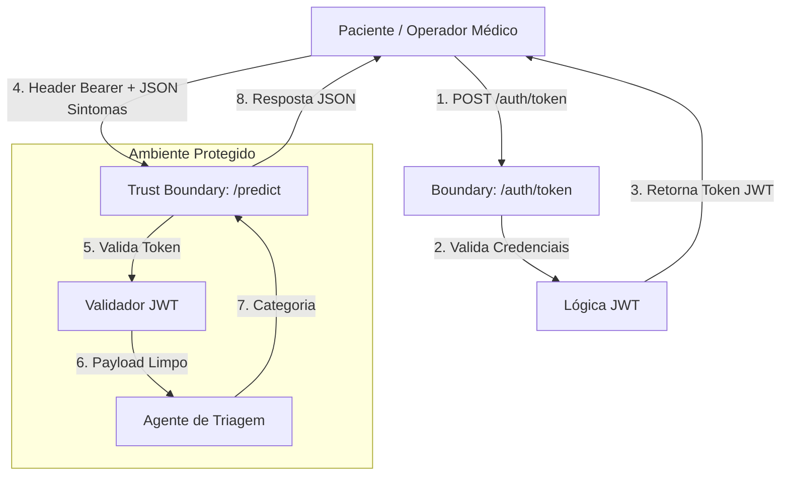

# HealthAssist API - Triagem Médica

API desenvolvida para o Projeto de Bloco de Análise e Segurança de Agentes de IA (Tema 3).

## Objetivo

Servir como backend seguro para triagem médica automatizada, priorizando o cumprimento da LGPD para dados sensíveis de saúde e prevenindo ataques de Negação de Serviço (DoS).

## Estrutura de Diretórios

```text
healthassist-api/
├── app/
│   ├── config.py
│   ├── main.py
│   ├── routers/
│   │   ├── auth.py
│   │   ├── health.py
│   │   └── predict.py
│   ├── schemas/
│   │   ├── auth.py
│   │   └── predict.py
│   └── security/
│       └── jwt.py
├── data/
│   └── .gitkeep
├── notebooks/
│   └── .gitkeep
│   └── health-assist.ipynb
├── .env.example
├── .gitignore
├── README.md
└── requirements.txt

```

## Como Executar Localmente

1. **Criar e ativar o ambiente virtual:**

```bash
python -m venv venv
source venv/bin/activate

```

2. **Instalar dependências:**

```bash
pip install -r requirements.txt

```

3. **Iniciar o servidor:**

```bash
uvicorn app.main:app --reload

```

4. **Endpoints principais:**

- `GET /health`: Estado da API (Acesso público).
- `POST /auth/token`: Autenticação e geração do token JWT.
- `POST /predict`: Classificação de triagem (Requer autenticação Bearer JWT).

## Documentação do Dataset (Tema 3)

- **Nome do Dataset:** Medical Symptom and Triage Dataset (ou equivalente escolhido pela dupla)
- **Fonte / Link:** [Inserir Link do Kaggle / Repositório de Dados]
- **Licença:** [Ex: CC BY 4.0 / Open Data Commons]
- **Justificativa da Escolha:** Contém registros textuais de sintomas e categorias clínicas de triagem sem identificadores pessoais diretos (PII), permitindo o treinamento do agente sob estrita conformidade com a LGPD.

## Arquitetura de Segurança e DFD



### Análise da Tríade CIA por Componente

- **Endpoint `/auth/token`:**
- **Confidencialidade:** Alta. Senhas e tokens transmitidos devem trafegar via HTTPS para evitar interceptação (Man-in-the-Middle).
- **Integridade:** Alta. As credenciais e claims do token assinado não podem ser adulteradas.
- **Disponibilidade:** Crítica. A indisponibilidade impede a operação dos médicos e do fluxo de triagem.

- **Endpoint `/predict` (Triagem Médica):**
- **Confidencialidade (Foco LGPD):** Crítica. Trata dados de saúde sensíveis (Art. 5º da LGPD). A API rejeita identificadores diretos (ex: CPF, nome) e restringe o payload aos sintomas e idade.
- **Integridade:** Alta. A descrição de sintomas e o retorno da triagem não podem ser adulterados em trânsito.
- **Disponibilidade (Foco DoS):** Crítica. Endpoints de triagem não podem sofrer exaustão de recursos por requisições em massa, demandando validação estrita via Pydantic e rate limiting futuro.

### Escolha do Dataset

- **Licença**: CC-BY-4.0;

- **Editor**: European Language Resources Association (ELRA);

- **Autores**: Farber, Fernanda Bufon and Brito, Iago Alves and Dollis, Julia Soares and Ribeiro, Pedro Schindler Freire Brasil and Sousa, Rafael Teixeira and Filho, Arlindo R. Galvão;

- **Razão da escolha**:
  Decidi usar esse dataset por dois motivos, o primeiro é que tem uma grande quantidade de dados de treino com mais de 100 mil perguntas entre pacientes e médicos, outro ponto é a relevância dos dados, para um modelo voltado a triagem de pacientes o dataset precisa conter interações relatando sintomas e possíveis respostas dos médicos, sendo assim, procurei um dataset que tivesse uma quantidade abrangente de sintomas e que os mencionasse nas mais diversas situações e esse dataset engloba perguntas realizadas na Doctoralia uma das maiores plataformas de telemedicina do Brasil.

- **Limpeza**:
  Devido a base de dados ter sido bem estruturada desde o princípio, na própria EDA é visível que não tem dados nulos ou duplicados e portanto não ví a necessidade de realizar limpeza dentro da base.
